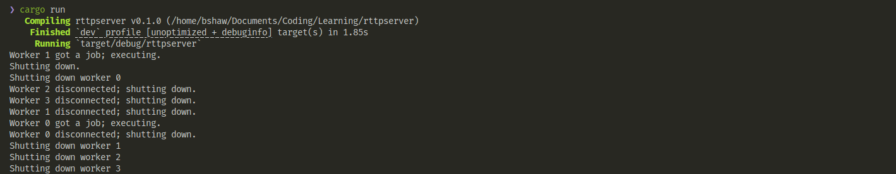

# rttpserver

A simple, educational multithreaded HTTP server written in Rust.

---

## Table of Contents

- [Overview](#overview)
- [Features](#features)
- [How It Works](#how-it-works)
- [Getting Started](#getting-started)
  - [Prerequisites](#prerequisites)
  - [Building](#building)
  - [Running](#running)
- [Usage](#usage)
- [Project Structure](#project-structure)
- [Screenshots](#screenshots)
- [Customization](#customization)
- [Learning Resources](#learning-resources)
- [Contributing](#contributing)
- [Acknowledgements](#acknowledgements)

---

## Overview

**rttpserver** is a basic HTTP server built for learning purposes. It demonstrates how to:

- Listen for TCP connections
- Parse simple HTTP requests
- Serve static HTML files
- Use a custom thread pool to handle multiple connections concurrently

---

## Features

- **Multithreaded:** Uses a custom thread pool for handling requests in parallel.
- **Static File Serving:** Serves `hello.html` for `/` and `/sleep`, and `404.html` for unknown routes.
- **Simulated Latency:** `/sleep` endpoint waits 5 seconds before responding.
- **Graceful Shutdown:** Handles two connections then shuts down (for demonstration).
- **Simple Routing:** Basic matching on request lines.
- **Easy to Extend:** Add more routes or files as needed.

---

## How It Works

1. The server listens on `127.0.0.1:7878`.
2. For each incoming connection, it assigns the work to a thread in the pool.
3. The thread reads the HTTP request, matches the path, and serves the appropriate HTML file.
4. If `/sleep` is requested, the thread sleeps for 5 seconds before responding.
5. After two connections, the server prints "Shutting down." and exits.

---

## Getting Started

### Prerequisites

- [Rust](https://www.rust-lang.org/tools/install) (stable toolchain)
- A modern web browser

### Building

```sh
cargo build --release
```

### Running

```sh
cargo run
```

---

## Usage

- Open your browser and go to [http://127.0.0.1:7878/](http://127.0.0.1:7878/) to see the hello page.
- Visit [http://127.0.0.1:7878/sleep](http://127.0.0.1:7878/sleep) to test the delayed response.
- Any other path (e.g., `/foo`) will show the 404 page.

---

## Project Structure

```
rttpserver/
├── src/
│   ├── main.rs        # Server entry point and connection handling
│   └── lib.rs         # Thread pool implementation
├── hello.html         # Main page served at /
├── 404.html           # 404 error page
├── img/               # Screenshots
└── README.md          # This file
```

---

## Screenshots

- **Running Server:**
  
- **Running Server Terminal:**
  

---

## Customization

- **Add More Routes:**  
  Edit the `handle_connection` function in `src/main.rs` to match more request lines and serve different files.
- **Change Thread Pool Size:**  
  Adjust the number in `ThreadPool::new(4)` to increase or decrease concurrency.
- **Serve More Files:**  
  Place additional HTML files in the project root and update the routing logic.

---

## Learning Resources

- [The Rust Programming Language Book](https://doc.rust-lang.org/book/)
- [Rust Standard Library Documentation](https://doc.rust-lang.org/std/)
- [Writing a Multithreaded Web Server (Rust Book)](https://doc.rust-lang.org/book/ch20-00-final-project-a-web-server.html)

---

## Contributing

Pull requests and suggestions are welcome! Feel free to fork this project and experiment.

---

## Acknowledgements

Inspired by the [Rust Book's web server project](https://doc.rust-lang.org/book/ch20-00-final-project-a-web-server.html).

---
